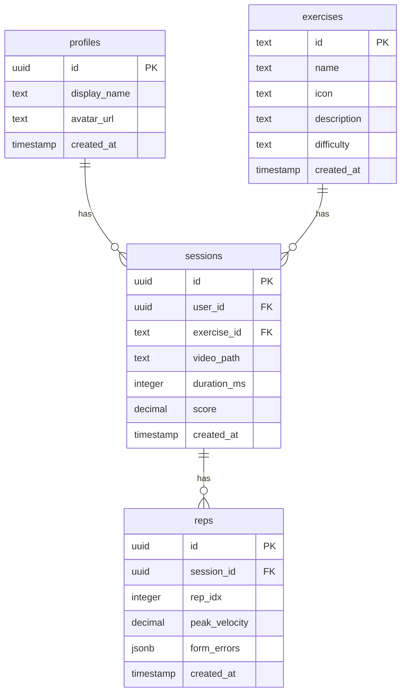

# Database Schema

## ER Diagram

## Row Level Security (RLS)

### Profiles
- Users can only view and update their own profile
- No public access

### Exercises
- Read-only access for all authenticated users
- No insert/update/delete allowed

### Sessions
- Users can only view and create their own sessions
- No public access
- No update/delete allowed

### Reps
- Users can only view and create reps for their own sessions
- No public access
- No update/delete allowed

## Materialized View

`user_progress_v` is automatically refreshed when sessions are modified:
- Groups sessions by user, exercise, and week
- Calculates average score and session count
- Used for progress tracking and analytics

## Indexes

- `idx_sessions_user_exercise_created`: Optimizes queries for user progress and session history
- Primary key indexes on all tables
- Foreign key indexes on all relationships 